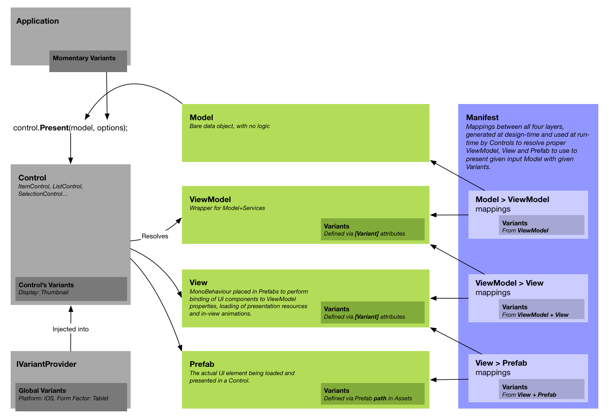

# Silphid.Unity

*Silphid.Unity* is a collection of high quality *.NET* libraries for the development of modern and fluid *Unity* applications leveraging *Reactive Extensions* and the *MVVM* pattern to achieve a fully dynamic, data-driven UI, advanced animation sequencing and transitioning, streamlined dependency injection, as well as asynchronous data loading, caching and conversion.

*Silphid.Unity* was inspired by my work of the past 17 years at [Simbioz](http://simbioz.com) and then [LVL Studio](http://lvlstudio.com), initially targeting the WPF framework, but now completely rethought and redesigned for [Unity](http://unity.com) and [Reactive Extensions](http://reactivex.io).

Even though it has been used to deliver multiple commercial-grade applications, it is still constantly evolving and improving, and I am just now releasing it to the public for the first time. Documentation and examples are still in their early stages and more work still has to be done to make the whole thing easier to integrate into your Unity projects. But, as they say, we have to start somewhere! ;)  All your comments are more than welcomed!

My sincere thanks to [LVL Studio](http://lvlstudio.com) for supporting this effort and being such a great place to work at. If you are looking for an outstanding job opportunity in the Montreal area, make sure to visit our [Careers](http://lvlstudio.com/en/careers) page! :)

# Getting started

- Download the latest release from [GitHub](https://github.com/Silphid/Silphid.Unity/releases).
- Drag the package file onto your Project window in Unity.
- Uncheck the files you do not need, while respecting the dependencies described in the *Dependencies* section.
    - I recommend initially importing all files, as it is easier to remove them afterwards, once  your code compiles (and is under source control, in case you need to revert or recover anything).
    - If you are not targeting the Windows Store, you may uncheck the `Plugins/WSA` folder.
- Try the examples and look at the scripts for those examples (there are lots of comments there).  More examples coming soon.

# Building from source

- If you intend to target the Windows Store / Xbox One, ensure your machine is configured properly by following these [instructions](https://docs.microsoft.com/en-us/windows/uwp/xbox-apps/development-environment-setup) first.
- Clone the repository from [GitHub](https://github.com/Silphid/Silphid.Unity.git).
- Do **not** open the Unity project just yet.  The `dll`s and `pdb`s must be compiled first, otherwise Unity will remove their corresponding `.meta` files and therefore lose their platform configs and placeholder mappings.
- Open and build this solution: `/Sources/Silphid.Unity.sln`
  - If not targeting the Windows Store, you may ignore all projects ending with `.UWP`
- All projects have a post-build step that copies their output `dll` and `pdb` to:
    - `/UnityProject/Assets/Plugins` (for regular .NET 3.5 projects)
    - `/UnityProject/Assets/Plugins/WSA` (for `.UWP` projects)
- You can now open the Unity project at `/UnityProject`.

# Dependencies

## Inter-Dependencies

The libraries were designed to minimize dependencies upon each other. However, higher level libraries do build upon lower level ones. For example, *Extensions*, which is at the bottom of the stack, only depends on Unity and can be used on its own, whereas *Showzup*, at the top of the stack, builds upon all the other libraries.


In other words, there is no dependency from lower level libraries to higher level ones, so you may easily strip those higher level libraries if you don't need them.  Many of the integration modules (shown as dark green boxes) are optional and can be removed (see *Optional Dependencies* below).

## Required Dependencies

### Unity 2017.1

*Silphid.Unity* requires Unity 2017.1 (still in beta, as of this writing) for its .NET 4.6 and C# 6.0 support.

### UniRx

Silphid.Unity also requires (and is distributed with) [UniRx](https://github.com/neuecc/UniRx) 5.5.0, the Unity implementation of the [Reactive Extensions](reactivex.io) (*Rx*).  It is a great and thorough library on which *Silphid.Unity* relies heavily (for example, all asynchronous operations return or use some form of `IObservable<T>`).

If you are new to Rx, there are plenty of resources on the Net.  Here are my personal recommendations:

- [The introduction to Reactive Programming you've been missing](https://gist.github.com/staltz/868e7e9bc2a7b8c1f754) - A great intro and overview. The place to start.
- [IntroToRx.com](introtorx.com) - The complete online version of a great book by Lee Campbell, very thorough and insightful.  But start with the previous link first! ;)
- [ReactiveX.io](reactivex.io) - The official reference hub for implementations of Rx on all platforms.
- [RxMarbles](rxmarbles.com) - Interactive diagrams to experiment with and better understand observables and their various operators.
- [UniRx](https://github.com/neuecc/UniRx) - Obviously, the UniRx documentation is another good read, with many good examples specific to Unity.

## Optional Dependencies

All optional integrations with third-parties have been isolated into their own sub-libraries or script sub-folders, that can be stripped away without impacting anything else.  For example, *Sequencit.DOTween* is an extension to *Sequencit* that supports integration with *DOTween*, but is not required for *Sequencit* to work.

### DOTween (only required for *Showzup*)

*Silphid.Unity* can be used with DemiGiant's [DOTween](http://dotween.demigiant.com/), a great high-performance tweening/animation library for Unity with a rich and clean fluent API.  It supports low-level time-based sequencing, which *Sequencit* nicely complements with higher-level observable-based sequencing.

*Note: The latest version of DOTween is distributed with Silphid.Unity in binary form, including a version that has been converted to UWP for Windows Store support (required for building the `.DOTween.UWP` projects from source).*

#### How to remove it, if you don't need it

Simply remove all `dll`s and `pdb`s with `DOTween` in their name from the `Assets/Plugins` and `Assets/Plugins/WSA` folders.

### Json.NET

Newtonsoft's [Json.NET](http://www.newtonsoft.com/json) is a very useful library for (de)serializing objects to/from JSON format.  However, it had issues with Unity, especially on iOS because of AOT, and therefore has been ported to Unity by [ParentElement](https://www.assetstore.unity3d.com/en/#!/content/11347) (there's also a version by [SaladLab](https://github.com/SaladLab/Json.Net.Unity3D), but I haven't tried it).

#### How to enable the Silphid.Unity integration scripts

Because *Json.NET* is a paid asset, it is not distributed with *Silphid.Unity* and you must therefore explicitly enable the integration scripts by adding the `JSON_NET` define to your Unity project (`Edit` > `Project Settings` > `Player` > `Other Settings` > `Scripting Define Symbols`).

# Extensions

*Extensions* is a library of various helpers and extension methods for types from *.NET*, *Unity*, *UniRx*, *DOTween*, etc, that provides a concise fluent syntax for many common or more complex operations. This is where I put everything I feel is missing from the APIs I use everyday.

## Features

- Extension methods for `float`, `double`, `int`, `long`, `string`, `DateTime`, `TimeSpan`, `IObservable<T>`, `IEnumerable<T>`, `GameObject`, `Transform`, `Vector2`, `Vector3`, `Quaternion`, `Tween`...
- Maths: `sign`, `abs`, `floor`, `ceiling`...
- Interpolation: linear, quad/cubic Bézier, inversed interpolation (ratio), transposition (from one range to another)...
- Wrapping, clamping, easing, filtering, smoothing, comparing
- `VirtualTimeScheduler` and `TestScheduler` that are currently missing from *UniRx* (*Silphid.Sequencit* uses those for unit testing), but I have submitted a pull request for them to be merged into *UniRx*.
- And much more!

# Sequencit

*Sequencit* extends *UniRx* with the concept of `ISequencer` for coordinating time-based operations in sequence or in parallel, such as playing sound effects and animations, performing transitions between pages or loading data from the Net. In the Rx tradition, all such operations are represented as `IObservable<Unit>`.

## Features

- `Sequence` - an *observable* sequencer to which you can add multiple observables to be executed sequentially.  It completes once its last child has completed.
- `Parallel` - an *observable* sequencer to which you can add multiple observables to be executed in parallel.  It completes once all its children have completed.
- `SequenceQueue` - a *non-observable* sequencer to which you can add multiple observables to be executed sequentially, as soon as possible.  Because it is not an observable it does not require subscribing to it and never completes.  As soon as it is created, it starts waiting for operations to be added to it, then executes those operations in order and, when it reaches the end of its queue, simply waits for more operations to be added to it.
- Various waiting and synchronization options:
  - Wait for a disposable to be disposed;
  - Wait for an observable's `OnNext`/`OnCompleted`;
  - Wait for some time interval...
- Extension methods for `IObservable<T>` and DOTween's `Tween`.


# Machina

*Machina* is a simple Rx-based polymorphic state machine.  It is said to be *polymorphic* in that it builds upon the general principle that a state machine should be in one and only one state at any given time, and extends it to allow some states to be polymorphically equivalent to others (in other words, inherit from them).

## Polymorphism example

The addition of polymorphism greatly simplifies the modelling of states and the handling of changes between them. For example, here are a few states for objects in a game I am working on: 


An object can either be *Idle* or *Busy*.  But *Moving* and *Falling* are both considered equivalent to being *Busy*.  There are also two ways of being considered *Moving*, by *Pushing* some other object or being *Pushed* by it.

It is then easy to handle whenever an object enters or leaves the *Busy* state, no matter the specific state that made it busy. The same applies to *Moving*, which can be handled generically, independently from the specific kind of movement.

## Wishlist

- Allow some states to be marked as *Abstract*, to prevent entering those states directly (only their derived states) and make intents clearer.

# Loadzup

Typically in *Unity*, depending on the source you want to load your assets from (*WWW*, *Resources*, *AssetBundleManager*...), you need to use a different class, with different syntax and peculiarities. And if you change the type of storage for an asset, you actually need to change your code.

*Loadzup* streamlines the loading of all assets and resources into a uniform, asynchronous pipeline, allowing assets to be addressed by URI.  If you change the type of storage for an asset, you only need to change the URI that points to it, not the code that accesses it.

For example, *Showzup* leverages *Loadzup* in order to load views from prefabs.  Any prefab can be associated with a view simply via its URI, no matter if it is stored in resources or in an asset bundle.

## Features

- Unified, asynchronous, IObservable-based loading pipeline.
- URI-based asset addressing according to schemes: ```http://```, ```bundle://```, ```res://```
- Support for loading from WWW, Resources (and soon AssetBundleManager).
- Support for Content/MIME types and custom request headers.
- Automatic conversion, with built-in converters for Sprite, Texture and Json.NET.
- Advanced caching policies (ETag/Last-Modified, cache/origin-first…).
- Highly modular and extensible (pluggable loaders and converters).


## Under Development

- Complete rewrite of Unity's `AssetBundleManager` (by [crazydadz](github.com/crazydadz)).
- AssetBundleManager support.

## Wishlist

- Support for Unity's new `WebRequest` (as replacement for `WWW`).
- Cache expiration
- Time-out as an option (more robust than `IObservable.Timeout()`).
- Priority queues
- `CancellationToken`s
- `IProgress`
- Scene Loading

# Showzup

*Showzup* is a Rx-based MVVM framework for dynamic, data-driven UI, asynchronous loading of views, custom visual transitions, multiple variants for each view, etc. It leverages Sequencit and Loadzup for flexible and fluid loading and animations.

## Features

- Abstract, flexible and lightweight
- Independent from GUI framework
- Automatic mapping of *Models*, *ViewModels*, *Views* and *Prefabs*.
- Data-driven UI (simply pass any *Model* object to a control and it will resolve and load the proper ViewModel and View to display it)
- Built-in, reusable, skinable controls (single item, list, selection...)
- Views are defined as prefabs
- Each ViewModel and View can have multiple variants (ie: for different platforms, form-factors, etc.)
- Customizable Rx-based transition system
    - Built-in transitions for uGUI (crossfade, slide, zoom, instant)
    - The sequencing of transitions allows phases (load/show/transition/hide...) to take as much time as they need.
- Simple extension methods for binding uGUI objects to *ViewModel* properties.
- Automatic routing of presentation requests (simply specify a `Target` variant in your `Options` and let `RoutingPresenter`s forward your request to the proper control).
- And much more!

## Overview

*Showzup* adopts a *data-driven* approach to UI development. You simply pass the raw data (the *Model*) to a *Control* and let it figure how to display it.  *Showzup* resolves which *ViewModel* to wrap the *Model* with, and which *View* and *Prefab* to show inside the control.  In MVVM, the *ViewModel*'s job is to augment the raw *Model* with all the necessary business and presentation logic, often by resorting to some services to interact with the rest of the application and the outside world.


## Models

Any object can be used as a *model*. Those objects should be as simple as possible and are therefore considered *POCO*s (Plain Old CLR Objects). Ideally, they even consist only of data, without much or any functionality, in which case they can be considered *DTO*s (Data Transfer Objects), as they only carry data between the different layers of your app (i.e.: from the network or disk).  They might sometimes require special attributes for deserializing from JSON or XML and might have to make design trade-offs in order to be compatible with those serialization methods; that's all right, as *ViewModels* will wrap those objects to provide a friendlier API for *Views*. 

## ViewModels

*ViewModel* classes must inherit from `ViewModel<TModel>`, where *TModel* is the type of the *Model* it wraps, and must also provide a public constructor with at least one parameter of type *TModel*, into which the model will be injected. Other dependencies, such as *Services*, can also be injected via other parameters of the constructor (this is what allows the *ViewModel* to interact with the rest of the application and the outside world).

The base class defines a handy `Model` property of type *TModel*, which you can use to access the underlying model's data.

## Views

*View* classes must inherit from `View<TViewModel>`, where *TViewModel* is the type of the *ViewModel* it wraps. *Views* are MonoBehaviours that you must attach to some *GameObjects* in your view *Prefabs* and, as such, cannot benefit from constructor injection like *ViewModels* do.  They must instead rely on property injection.

The base class defines a handy `ViewModel` property of type *TViewModel*, which you can use to bind data to your UI GameObjects.

Typically, all views override the `Load()` method, which is where binding are made and where resources are loaded asynchronously:

```c#
public class FooView : View<FooViewModel>
{
  public Image Photo; // Must be assigned an Image game object in Inspector window
  public Text Title;  //  "          "    a Text          "           "
  
  public override IObservable<Unit> Load()
  {
    Bind(Title, ViewModel.Title);
    return BindAsync(Photo, ViewModel.PhotoUri); // View will be presented only *after* photo is finished loading.
  }
}
```

If no asynchronous binding are performed in the Load() method (or if you want the view to be presented immediately, without waiting for its content to load first), just return `Observable.Empty<Unit>` or `null`, like in the following example, where the view will be presented immediately, and the image it contains will load asynchronously and appear in a second time:

```c#
  public override IObservable<Unit> Load()
  {
    Bind(Title, ViewModel.Title);
    Bind(Photo, ViewModel.PhotoUri);
    return null; // View will be presented immediately, without waiting for photo to load.
  }
```

## Prefabs

You define the visual representation of your views as simple prefabs.  On the root game object of that prefab you must attach a view-derived mono behaviour that will be the link between your UI and code. In that prefab you create your layout and place different UI objects.  You then drag your various UI objects onto the properties of the view in the Inspector window, in order to make them accessible to your view's code.

All your view prefabs must be contained within your resources or asset bundles, so that they may be loaded at run-time (more on that in the *Manifest* section).

## Controls

*Controls* are the generic containers responsible for presenting arbitrary raw data (the *model*) in a visual way (the *view+prefab*). *Showzup* provides a series of useful *controls*, which can be skinned freely:

- `ItemControl` displays a single item as a single *view*;
- `ListControl` displays a collection of items as multiple *views* (potentially of different types); 
- `SelectionControl` extends `ListControl` to add current item awareness;
- `TransitionControl` extends `ItemControl` to add visual transitions between *views*;
- `NavigationControl` extends `ItemControl` to add browser-like Back/Forward navigation support.

### IPresenter

All *controls* implement the *IPresenter* interface, which allows to asynchronously present any object (*model*), with optional *Options*. Because the loading and presenting of *views* is asynchronous, you must always subscribe to the returned observable:

```c#
var disposable = control.Present(myModelObject, options).Subscribe();
```

## Manifest

The *Manifest* is an asset file that stores the mappings between the different models, view models, views and prefabs.


To create a manifest from the main menu, select *Assets > Create > Showzup > Manifest*. The manifest will then be automatically selected and displayed in the Inspector window. You must then configure the path within your assets where your prefabs are located and the URI prefix that will be prepended to each prefab's relative path, in order to load it at run-time. Finally, press the *Build* button to regenerate the manifest using those new configurations.

### How the Manifest is generated

- All *ViewModel*-derived classes are scanned and their base class declaration (`... : ViewModel<TModel>`) is used to determine the *Model* > *ViewModel* mappings. 
- Similarly, all *View*-derived classes are scanned and their base class declaration (`... : View<TViewModel>`) is used to determine the *ViewModel* > *View* mappings.
- Finally, all prefabs in the given folder and sub-folders are scanned for any *View*-derived MonoBehaviours attached to them to determine the *View* > *Prefab* mappings.
- *Variants* may be associated with each of those mappings (as described in following section *Variants*).

## Variants

You might want the same model object, depending on context, to be displayed in different ways, possibly with different presentation logics. In *Showzup*, those different contexts are named *Variants* and are used to select the proper view model, view and prefab, whenever there is more than one that matches.

### Examples of variants

The following are only examples of the kinds of variants that might be required in some arbitrary application.  There are no built-in variants, so you must define yourself those that make sense to your particular application.

#### Display variants

- **Page**: Large image, with a large title, a smaller sub-title and a full description paragraph.
- **Popup**: Large image with a thin title underneath.
- **List Item**: Only a small thumbnail next to a title.
- **Menu Item**: Only title.
- ...

#### Form-factor variants

- **Tablet**: Many panels, with more details in each one.
- **Mobile**: Fewer panels, with fewer details in each one.
- **TV**: Similar to tablet, but with larger fonts for 10-foot viewing.
- ...

#### Orientation variants

- **Portrait**: Vertical layout, with everything stacked in a single column.
- **Landscape**: Two columns, with an overview on the left and details on the right.

#### Platform variants

- **iOS**: Top nav-bar, with iOS-like back button in the upper-left corner.
- **Android**: No back button, as OS provides its own navigation for that.
- ...

#### Theme variants

- **Christmas**: Christmas-themed skin
- **Halloween**: Halloween-themed skin
- ...

### Supported variants vs Requested variants

If you tag some view models, views or prefabs with one or more variants, those are said to be their *supported variants*.

When time comes to display a model, we need to specify the variants to be used. Those are the *requested variants*. *Showzup* resolve the proper view models, views and prefabs to use by going through all candidate mappings and comparing their *supported variants* with the variants you requested. 

### Variants are grouped

Each variant is part of a *Variant Group*. In the above examples, the *Page* variant would be part of the *Display* group.

### No variant means *generic*

If a view model, view or prefab is not tagged with any variant from a given group, it is considered generic and can be used for 


### Variants can be combined across groups

Variants can become very powerful when they are combined.  For example, you are likely to want to use a different prefab for the *Mobile+Landscape* version of a page to be different from its *Tablet+Landscape* version.

### A specific variant



## Under Development

- Customizable multi-phase transitioning.

## How to get started

### Configure Dependency Injection

```c#
using Silphid.Loadzup;
using Silphid.Loadzup.Resource;
using Silphid.Showzup;
using Silphid.Showzup.Injection;
using UnityEngine;

public class Application : MonoBehaviour
{
    public Manifest Manifest;

    public void Start()
    {
        var container = new Container(Debug.unityLogger);

        container.BindInstance<ILoader>(CreateLoader());
        container.BindSingle<IScoreEvaluator, ScoreEvaluator>();
        container.BindSingle<IViewResolver, ViewResolver>();
        container.BindSingle<IViewLoader, ViewLoader>();
        container.BindInstance<IManifest>(Manifest);
        container.BindInstance<IInjector>(new Injector(go => container.Inject(go)));
        container.BindInstance<IViewModelFactory>(CreateViewModelFactory(container));
        container.BindInstance<IVariantProvider>(new VariantProvider(Display.Group, Form.Group, Platform.Group));

        container.InjectAllGameObjects();
    }

    private ViewModelFactory CreateViewModelFactory(Container container)
    {
        return new ViewModelFactory((viewModelType, parameters) =>
            (IViewModel) container.Resolve(
                viewModelType,
                new Container().BindInstances(parameters)));
    }

    private CompositeLoader CreateLoader()
    {
        var compositeConverter = new CompositeConverter(
            new SpriteConverter());

        return new CompositeLoader(
            new ResourceLoader(compositeConverter));
    }
}
```

### Define Variants

### Create Model Classes

### Create ViewModel Classes

### Create View Classes

### Create Storyboard Scene

### Create View Prefabs

### Place a Control

### Present a Model in Control


# Experimental Libraries

Some unclassified libraries, still in an early development stage, to be evolved, reorganized and time-tested.

## Abstracam

A lightweight system for manipulating and interpolating between virtual cameras.  You can manipulate multiple virtual cameras freely, interpolate between them and synchronize a real camera with them.

- Pluggable camera system: `FreeCamera`, `ReadOnlyCamera`, `TransitionCamera`, `SmoothingCamera`.
- Cameras can be observed as Observables.

## Silphid.Sequencit.Input

An experimental input layering/filtering system, currently included in *Silphid.Sequencit*, but should be externalized eventually.

- Allows multiple input layers to be defined in a nested hierarchy.
- Each layer can be disabled, including all its nested descendant layers.
- Multiple parts of the code can request a layer to be disabled and only when all of them have released this request (by disposing their IDisposable) will the layer effectively be reactivated.  This is what I call the "Flag" pattern (an implementation of which can be found in Silphid.Extensions.DataTypes).
- This system is abstract and independent from any input system. When detecting some input, you have to manually query a layer to determine whether it is currently active or not.