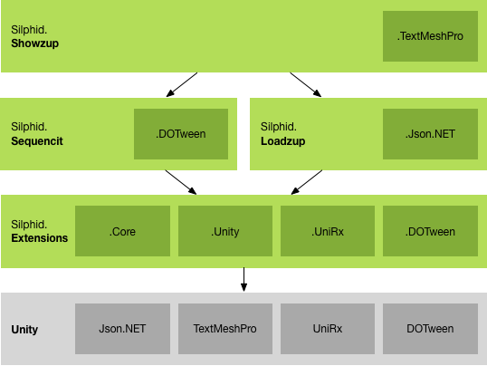

# Silphid.Unity

*Silphid.Unity* is a collection of *.NET* libraries for the development of modern, robust and fluid *Unity* applications, with dynamic data-driven UI using a lightweight *MVVM* approach, advanced sequencing and transitioning, as well as asynchronous data loading, caching and conversion.  It is well integrated with [UniRx](https://github.com/neuecc/UniRx), [Zenject](https://github.com/modesttree/Zenject), [DOTween](http://dotween.demigiant.com/), [Json.NET](https://www.assetstore.unity3d.com/en/#!/content/11347) and [Text Mesh Pro](https://www.assetstore.unity3d.com/en/#!/content/84126).

*Silphid.Unity* was inspired by my work of the past 17 years at [Simbioz](http://simbioz.com) and then [LVL Studio](http://lvlstudio.com), initially targeting the WPF framework, but has now been completely redesigned for [Unity](http://unity.com) and the [Reactive Extensions](http://reactivex.io).

Even though it has been used to deliver multiple commercial-grade applications, it is still constantly evolving and improving, and I am just now releasing it to the public for the first time. Documentation is still in its early stages and more work still has to be done to make it easier to integrate into your Unity projects. But, as they say, we have to start somewhere! ;)  All your comments are more than welcome!

My sincere thanks to [LVL Studio](http://lvlstudio.com) for supporting this effort and being such a great place to work at. If you are looking for an outstanding job opportunity in the Montreal area, make sure to visit our [Careers](http://lvlstudio.com/en/careers) page! :)

# Getting started

- Download the latest release from [GitHub](https://github.com/Silphid/Silphid.Unity/releases).
- Drag the package file onto your Project window in Unity.
- Uncheck the files you do not need, while respecting the dependencies described in the *Dependencies* section.
    - I recommend initially importing all files, as it is easier to remove them afterwards, once  your code compiles (and is under source control, in case you need to revert or recover anything).
    - If you are not targeting the Windows Store, you may uncheck the `Plugins/WSA` folder.
- Try the examples and look at the code (there are lots of comments there).  More examples coming soon.

# Building from source

- If you intend to target the Windows Store / Xbox One, ensure your machine is configured properly by following these [instructions](https://docs.microsoft.com/en-us/windows/uwp/xbox-apps/development-environment-setup) first.
- Clone the repository from [GitHub](https://github.com/Silphid/Silphid.Unity.git).
- Do **not** open the Unity project just yet.  The `dll`s and `pdb`s must be compiled first, otherwise Unity will remove their corresponding `.meta` files and therefore lose their platform configs and placeholder mappings.
- Open and build this solution: `/Sources/Silphid.Unity.sln`
  - If not targeting the Windows Store, you may ignore all projects ending with `.UWP`.
- All projects have a post-build step that copies their output `dll` and `pdb` to:
    - `/UnityProject/Assets/Plugins` (for regular .NET 3.5 projects)
    - `/UnityProject/Assets/Plugins/WSA` (for `.UWP` projects)
- You can now open the Unity project at `/UnityProject`.

# Dependencies

## Inter-Dependencies

The libraries were designed to minimize dependencies upon each other. However, higher level libraries do build upon lower level ones. For example, *Silphid.Extensions*, which is at the bottom of the stack, only depends on Unity and can be used on its own, whereas *Silphid.Showzup*, at the top of the stack, builds upon all three other libraries.



In other words, there is no dependency from lower level libraries to higher level ones, so you may easily strip those higher level libraries if you don't need them.  Many of the integration modules (shown as dark green boxes) are optional and can be removed (see *Optional Dependencies* below).

## Required Dependencies

### C# 6.0 Support

*Silphid.Unity* leverages Alexzzzz's great [CSharp60Support](https://bitbucket.org/alexzzzz/unity-c-5.0-and-6.0-integration/src), which makes it possible to use most of the C# 6.0 language in Unity, even if Unity is still limited to .NET 3.5.

If you do **not** want to integrate *CSharp60Support* into your project and prefer sticking to C# 4.0 for your own scripts, that's fine, as long as you use *Silphid.Unity*'s precompiled `dll`s, along with `CSharp60Support.Polyfill.dll` (the minimal subset of *CSharp60Support* required by *Silphid.Unity* at run-time, that is, support for formattable strings).

*Note: On Windows Store, many of C# 6.0 features won't be available, such as `async`/`await`, Caller Info attributes and everything from `System.Threading.dll` (such as concurrent collections). If you are **not** targeting Windows Store and want to use the complete set of CSharp60Support's features, simply import the package at `/UnityProject/CSharp60Support` into your project, while taking great care of excluding the `FormattableString.cs` and `FormattableStringFactory.cs` files, which are already included in  `CSharp60Support.Polyfill.dll`.*

### UniRx

[UniRx](https://github.com/neuecc/UniRx) is the Unity implementation of the [Reactive Extensions](reactivex.io) (*Rx*).  It is a great and thorough library on which *Silphid.Unity* relies heavily (for example, all asynchronous members return or use some form of `IObservable<T>`). 

*Note: The latest version of UniRx is distributed with Silphid.Unity, including source code and prebuilt binaries, mainly because it has been slightly customized for improved multiplatform support, especially fixing many errors and namespace conflicts occuring when building for Windows Store with the .NET Scripting Backend.  I tried many approaches and came up with this rather clean compromise, which I will soon blog about.*

If you are new to Rx, there are plenty of great resources on the Net.  Here are my personal recommendations:

- [The introduction to Reactive Programming you've been missing](https://gist.github.com/staltz/868e7e9bc2a7b8c1f754) - A great intro and overview. The place to start.
- [IntroToRx.com](introtorx.com) - The complete online version of a great book by Lee Campbell, very thorough and insightful.  But start with the previous link first! ;)
- [ReactiveX.io](reactivex.io) - The official reference hub for implementations of Rx on all platforms.
- [RxMarbles](rxmarbles.com) - Interactive diagrams to experiment with and better understand observables and their various operators.
- [UniRx](https://github.com/neuecc/UniRx) - Obviously, the UniRx documentation is another good read, with many good examples specific to Unity.

## Optional Dependencies

All optional integrations with third-parties have been isolated into their own sub-libraries or script sub-folders, that can be stripped away without impacting anything else.  For example, *Silphid.Sequencit.DOTween* is an extension to *Silphid.Sequencit* that supports integration with *DOTween*, but is not required for *Silphid.Sequencit* to work.

### DOTween (only required for Silphid.Showzup)

*Silphid.Unity* can be used with DemiGiant's [DOTween](http://dotween.demigiant.com/), a great high-performance tweening/animation library for Unity with a rich and clean fluent API.  It supports low-level time-based sequencing, which *Silphid.Sequencit* nicely complements with higher-level observable-based sequencing.

*Note: The latest version of DOTween is distributed with Silphid.Unity in binary form, including a version that has been converted to UWP for Windows Store support (required for building the `.DOTween.UWP` projects from source).*

#### How to remove it, if you don't need it

Simply remove all `dll`s and `pdb`s with `DOTween` in their name from the `Assets/Plugins` and `Assets/Plugins/WSA` folders.

### Zenject

Steve Vermeulen's [Zenject](https://github.com/modesttree/Zenject) library is simply the greatest and most powerful dependency injection library available for Unity.

*Silphid.Unity* depends only on the `Usage` subfolder of *Zenject* (basically just interface and attribute definitions).  As such, that subset has been extracted to `Zenject.Usage.dll`, which is all that is required by *Silphid.Unity* at run-time (or to build it from source).

#### How to import Zenject and enable the Silphid.Unity integration scripts

Zenject is not distributed with *Silphid.Unity*. If you want to use Zenject in your own project (which I *strongly* encourage), simply download the latest release from [GitHub](https://github.com/modesttree/Zenject/releases) and import it into your project, while taking great care of excluding the `Usage` subfolder, which is already included in `Zenject.Usage.dll`.

You must then explicitly enable the integration scripts by adding the `ZENJECT` define to your Unity project (`Edit` > `Project Settings` > `Player` > `Other Settings` > `Scripting Define Symbols`).

### Json.NET

Newtonsoft's [Json.NET](http://www.newtonsoft.com/json) is a very useful library for (de)serializing objects to/from JSON format.  However, it had issues with Unity, especially on iOS because of AOT, and therefore has been ported to Unity by [ParentElement](https://www.assetstore.unity3d.com/en/#!/content/11347) (there's also a version by [SaladLab](https://github.com/SaladLab/Json.Net.Unity3D), but I haven't tried it).

#### How to enable the Silphid.Unity integration scripts

Because *Json.NET* is a paid asset, it is not distributed with *Silphid.Unity* and you must therefore explicitly enable the integration scripts by adding the `JSON_NET` define to your Unity project (`Edit` > `Project Settings` > `Player` > `Other Settings` > `Scripting Define Symbols`).

# Silphid.Extensions

*Silphid.Extensions* is a library of various helpers and extension methods for types from *.NET*, *Unity*, *UniRx*, *DOTween*, etc, that provides a concise fluent syntax for many common or more complex operations. This is where I put everything I feel is missing from the APIs I use everyday.

## Features

- Extension methods for `float`, `double`, `int`, `long`, `string`, `DateTime`, `TimeSpan`, `IObservable<T>`, `IEnumerable<T>`, `GameObject`, `Transform`, `Vector2`, `Vector3`, `Quaternion`, `Tween`...
- Maths: `sign`, `abs`, `floor`, `ceiling`...
- Interpolation: linear, quad/cubic Bézier, inversed interpolation (ratio), transposition (from one range to another)...
- Wrapping, clamping, easing, filtering, smoothing, comparing
- `VirtualTimeScheduler` and `TestScheduler` that are currently missing from *UniRx* (*Silphid.Sequencit* uses those for unit testing), but I have submitted a pull request for them to be merged into *UniRx*.
- And much, much more!

# Silphid.Sequencit

*Silphid.Sequencit* extends *UniRx* with the concept of `ISequencer` for coordinating time-based operations in sequence or in parallel, such as playing sound effects and animations, performing transitions between pages or loading data from the Net. In the Rx tradition, all such operations are represented as `IObservable<Unit>`.

## Features

- `Sequence` - an *observable* sequencer to which you can add multiple observables to be executed sequentially.  It completes once its last child has completed.
- `Parallel` - an *observable* sequencer to which you can add multiple observables to be executed in parallel.  It completes once all its children have completed.
- `SequenceQueue` - a *non-observable* sequencer to which you can add multiple observables to be executed sequentially, as soon as possible.  Because it is not an observable it does not require subscribing to it and never completes.  As soon as it is created, it starts waiting for operations to be added to it, then executes those operations in order and, when it reaches the end of its queue, simply waits for more operations to be added to it.
- Various waiting and synchronization options:
  - Wait for a disposable to be disposed;
  - Wait for an observable's `OnNext`/`OnCompleted`;
  - Wait for some time interval...
- Extension methods for `IObservable<T>` and DOTween's `Tween`.

# Silphid.Loadzup

Typically in *Unity*, depending on the source you want to load your assets from (*WWW*, *Resources*, *AssetBundleManager*...), you need to use a different class, with different syntax and peculiarities. And if you change the type of storage for an asset, you actually need to change your code.

*Silphid.Loadzup* streamlines the loading of all assets and resources into a uniform, asynchronous pipeline, allowing assets to be addressed by URI.  If you change the type of storage for an asset, you only need to change the URI that points to it, not the code that accesses it.

For example, *Silphid.Showzup* leverages *Silphid.Loadzup* in order to load views from prefabs.  Any prefab can be associated with a view simply via its URI, no matter if it is stored in resources or in an asset bundle.

## Features

- Unified, asynchronous, IObservable-based loading pipeline.
- URI-based asset addressing according to schemes: ```http://```, ```bundle://```, ```res://```
- Support for loading from WWW, Asset Bundles and Resources.
- Support for Content/MIME types and custom request headers.
- Automatic conversion, with built-in converters for Sprite, Texture and Json.NET.
- Advanced caching policies (ETag/Last-Modified, cache/origin-first…).
- Highly modular and extensible (pluggable loaders and converters).

## Under Development

- Complete rewrite of Unity's `AssetBundleManager` (by [crazydadz](github.com/crazydadz)).

## Wishlist

- Support for Unity's new `WebRequest` (as replacement for `WWW`).
- Cache expiration
- Time-out as an option (more robust than `IObservable.Timeout()`).
- Priority queues
- `CancellationToken`s
- `IProgress`
- Scene Loading

# Silphid.Showzup

*Silphid.Showzup* is a lightweight MVVM framework for dynamic, data-driven UI, asynchronous loading of views, custom visual transitions, multiple variants for each view, etc. It leverages Sequencit and Loadzup for flexible and fluid loading and animations.

## Features

- Abstract, flexible and lightweight
- Independent from GUI framework
- Simple attribute-based mapping of Models, ViewModels and Views
- Data-driven UI (simply assign any Model/ViewModel object to a control and it will resolve and load the proper View to display it)
- Abstract container controls (can be skinned with arbitrary UI)
    - `ItemControl` (displays a single item in a view)
    - `ListControl` (displays a collection of items in multiple  views)
    - `SelectionControl` (extends `ListControl` with current item awareness)
    - `TransitionControl` (extends `ItemControl` with visual transitions between views)
    - `NavigationControl` (extends `ItemControl` with browser-like Back/Forward navigation support)
- Views are defined as prefabs
- Each view can have multiple variants
- Customizable transition system based on IObservable
    - Built-in transitions for uGUI (crossfade, slide, zoom, instant)
    - The sequencing of transitions allows phases (load/show/transition/hide...) to take as much time as they need.
- Simple binding extensions for uGUI and TextMeshPro
- And much, much more!

## Under Development

- Customizable multi-phase transitioning.
- Config-based Model/ViewModel/View mapping. 

## Wishlist

- Support for hierarchy of variants
- Fluent syntax for Model/ViewModel/View mapping (instead of attribute-based)

# Experimental Libraries

Some unclassified libraries, still in an early development stage, to be evolved, reorganized and time-tested.

## Silphid.Abstracam

A lightweight system for manipulating and interpolating between virtual cameras.  You can manipulate multiple virtual cameras freely, interpolate between them and synchronize a real camera with them.

- Pluggable camera system: `FreeCamera`, `ReadOnlyCamera`, `TransitionCamera`, `SmoothingCamera`.
- Cameras can be observed as Observables.

## Silphid.Sequencit.Machines

An experimental UniRx-based state machine, currently included in *Silphid.Sequencit*, but should be externalized eventually.

## Silphid.Sequencit.Input

An experimental input layering/filtering system, currently included in *Silphid.Sequencit*, but should be externalized eventually.

- Allows multiple input layers to be defined in a nested hierarchy.
- Each layer can be disabled, including all its nested descendant layers.
- Multiple parts of the code can request a layer to be disabled and only when all of them have released this request (by disposing their IDisposable) will the layer effectively be reactivated.  This is what I call the "Flag" pattern (an implementation of which can be found in Silphid.Extensions.DataTypes).
- This system is abstract and independent from any input system. When detecting some input, you have to manually query a layer to determine whether it is currently active or not.