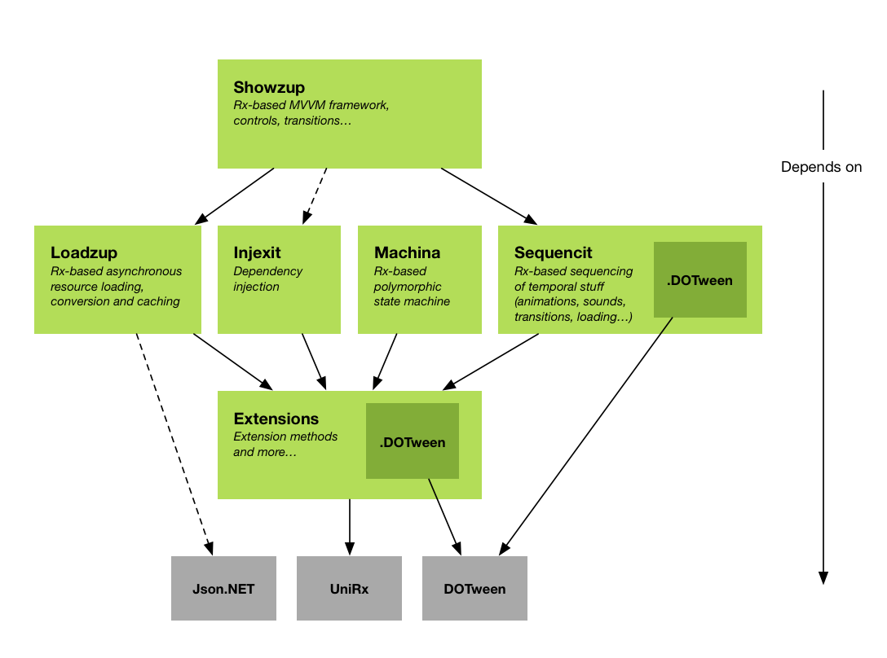
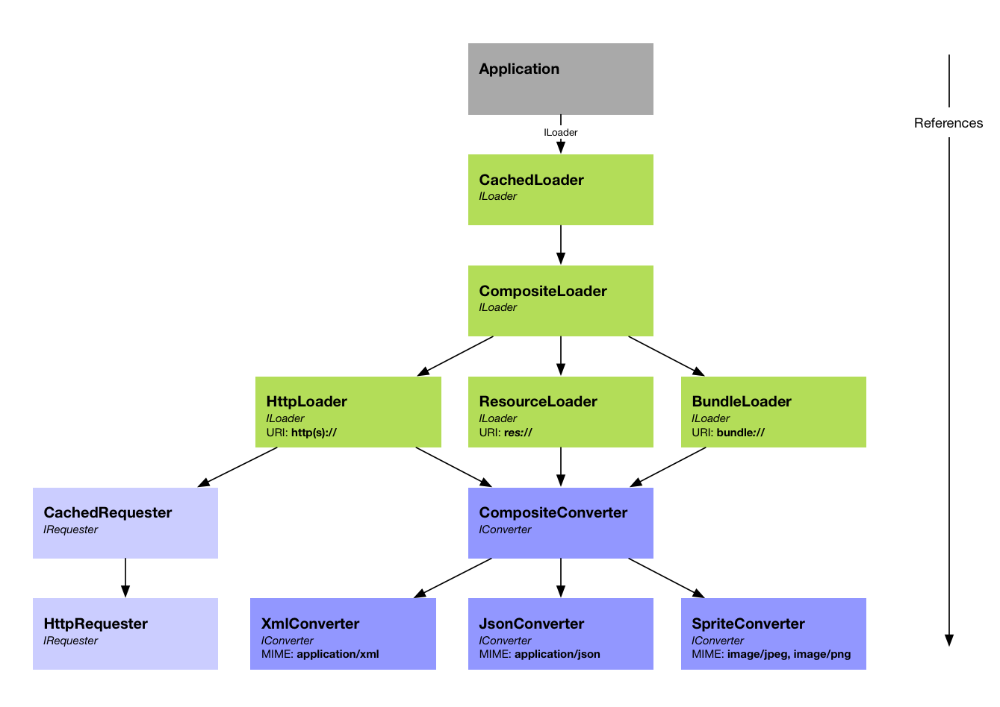
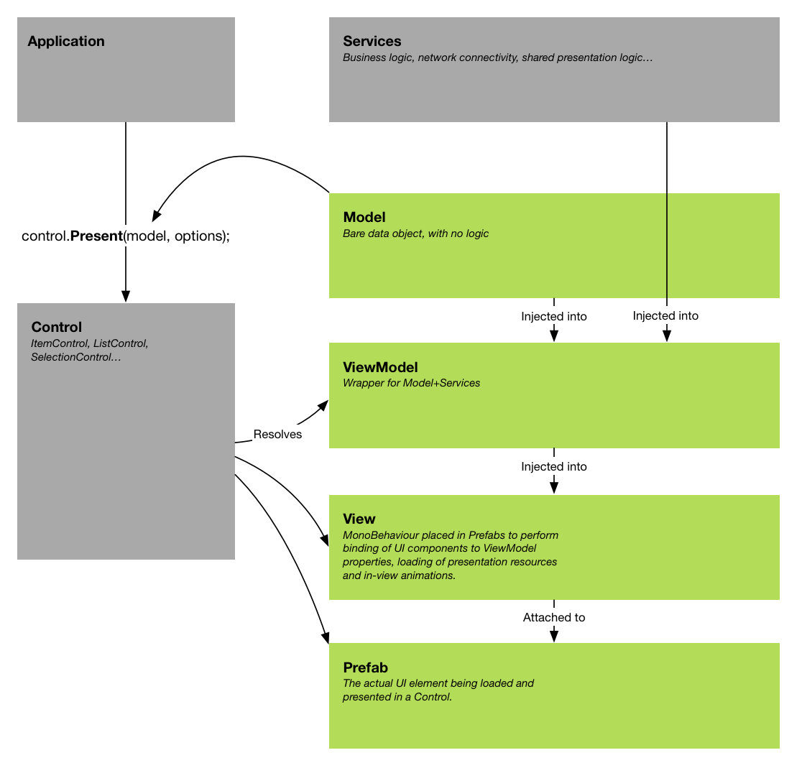
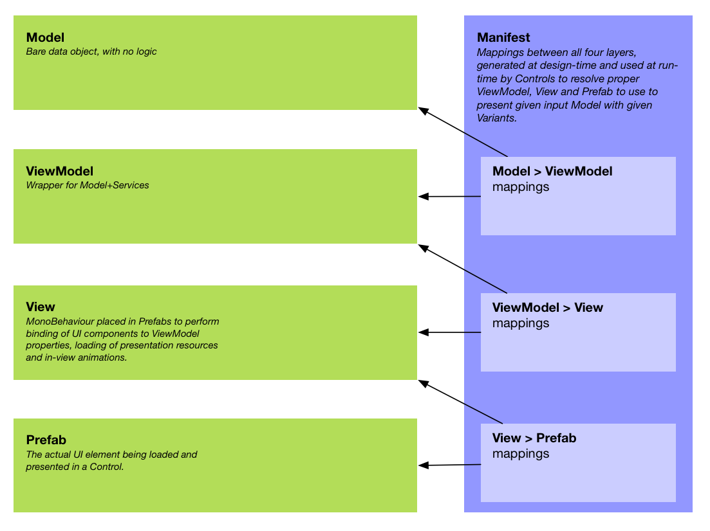
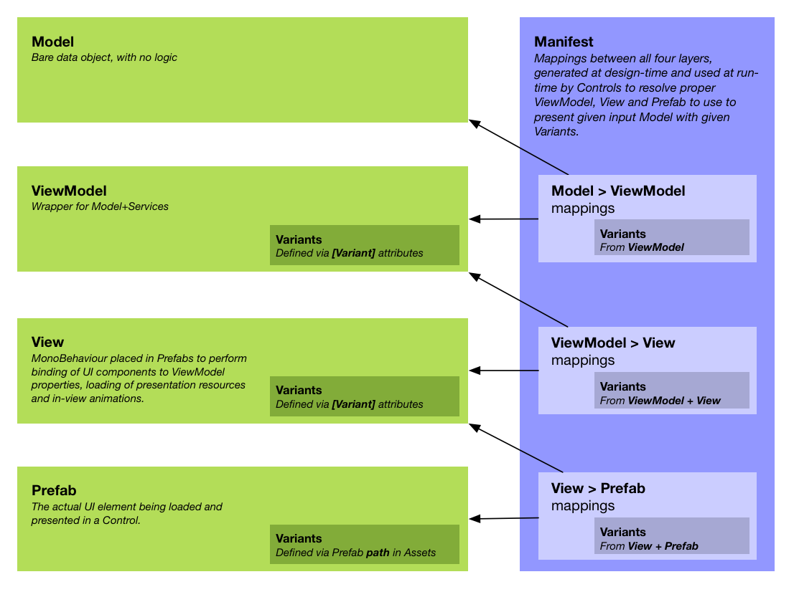

# Silphid.Unity

*Silphid.Unity* is a collection of high quality *.NET* libraries for the development of modern and fluid *Unity* applications leveraging *Reactive Extensions* and the *MVVM* pattern to achieve a fully dynamic, data-driven UI, advanced animation sequencing and transitioning, streamlined dependency injection, as well as asynchronous data loading, caching and conversion.

*Silphid.Unity* was inspired by my work of the past 17 years at [Simbioz](http://simbioz.com) and then [LVL Studio](http://lvlstudio.com), initially targeting the WPF framework, but now completely rethought and redesigned for [Unity](http://unity.com) and [Reactive Extensions](http://reactivex.io).

Even though it has been used to deliver multiple commercial-grade applications, it is still constantly evolving and improving, and I am just now releasing it to the public for the first time. Documentation and examples are still in their early stages and more work still has to be done to make the whole thing easier to integrate into your Unity projects. But, as they say, we have to start somewhere! ;)  All your comments are more than welcomed!

My sincere thanks to [LVL Studio](http://lvlstudio.com) for supporting this effort and being such a great place to work at. If you are looking for an outstanding job opportunity in the Montreal area, make sure to visit our [Careers](http://lvlstudio.com/en/careers) page! :)

# Libraries

- [Extensions](#Extensions) - Extension methods (and more) for *.NET*, *Unity*, *UniRx*, *DOTween*, etc, providing a concise fluent syntax for many useful operations.
- [Sequencit](#Sequencit) - Rx-based sequencing of elements with dynamic durations.
- [Injexit](#Injexit) - Lightweight dependency injection framework with a clean and efficient fluent syntax.
- [Machina](#Machina) - Lightweight Rx-based state machine with polymorphic states.
- [Loadzup](#Loadzup) - Rx-based asynchronous asset/resource/object loading and conversion, with simple URI-addressing.
- [Showzup](#Showzup) - Full-fledged MVVM framework with asynchronous data-driven UI, custom transitions and dynamic view variants.

# Getting started

- Download the latest release from [GitHub](https://github.com/Silphid/Silphid.Unity/releases).
- Drag the package file onto your Project window in Unity.
- Uncheck the files you do not need, while respecting the dependencies described in the *Dependencies* section.
    - I recommend initially importing all files, as it is easier to remove them afterwards, once  your code compiles (and is under source control, in case you need to revert or recover anything).
    - If you are not targeting the Windows Store, you may uncheck the `Plugins/WSA` folder.
- Try the examples and look at the scripts for those examples (there are lots of comments there).  More examples coming soon.

# Building from source

- If you intend to target the Windows Store / Xbox One, ensure your machine is configured properly by following these [instructions](https://docs.microsoft.com/en-us/windows/uwp/xbox-apps/development-environment-setup) first.
- Clone the repository from [GitHub](https://github.com/Silphid/Silphid.Unity.git).
- Do **not** open the Unity project just yet.  The `dll`s and `pdb`s must be compiled first, otherwise Unity will remove their corresponding `.meta` files and therefore lose their platform configs and placeholder mappings.
- Open and build this solution: `/Sources/Silphid.Unity.sln`
  - If not targeting the Windows Store, you may ignore all projects ending with `.UWP`
- All projects have a post-build step that copies their output `dll` and `pdb` to:
    - `/UnityProject/Assets/Plugins` (for regular .NET 3.5 projects)
    - `/UnityProject/Assets/Plugins/WSA` (for `.UWP` projects)
- You can now open the Unity project, located at `/UnityProject`.

# Dependencies

## Inter-Dependencies

The libraries were designed to minimize dependencies upon each other. However, higher level libraries do build upon lower level ones. For example, *Extensions*, which is at the bottom of the stack, only depends on Unity and can be used on its own, whereas *Showzup*, at the top of the stack, builds upon all the other libraries.



In other words, there is no dependency from lower level libraries to higher level ones, so you may easily strip those higher level libraries if you don't need them.  Many of the integration modules (shown as dark green boxes) are optional and can be removed (see *Optional Dependencies* below).

## Required Dependencies

### Unity 2017.1

*Silphid.Unity* requires Unity 2017.1 for its .NET 4.6 and C# 6.0 support.

### UniRx

*Silphid.Unity* also requires (and is distributed with) [UniRx](https://github.com/neuecc/UniRx) 5.5.0, the Unity implementation of the [Reactive Extensions](reactivex.io) (*Rx*).  It is a great and thorough library on which *Silphid.Unity* relies heavily (for example, all asynchronous operations return or use some form of `IObservable<T>`).

If you are new to Rx, there are plenty of resources on the Net.  Here are my personal recommendations:

- [The introduction to Reactive Programming you've been missing](https://gist.github.com/staltz/868e7e9bc2a7b8c1f754) - A great intro and overview. The place to start.
- [IntroToRx.com](introtorx.com) - The complete online version of a great book by Lee Campbell, very thorough and insightful.  But start with the previous link first! ;)
- [ReactiveX.io](reactivex.io) - The official reference hub for implementations of Rx on all platforms.
- [RxMarbles](rxmarbles.com) - Interactive diagrams to experiment with and better understand observables and their various operators.
- [UniRx](https://github.com/neuecc/UniRx) - Obviously, the UniRx documentation is another good read, with many good examples specific to Unity.

## Optional Dependencies

All optional integrations with third-parties have been isolated into their own sub-libraries or script sub-folders, that can be stripped away without impacting anything else.  For example, *Sequencit.DOTween* is an extension to *Sequencit* that supports integration with *DOTween*, but is not required for *Sequencit* to work.

### DOTween (only required for *Showzup*)

*Silphid.Unity* can be used with DemiGiant's [DOTween](http://dotween.demigiant.com/), a great high-performance tweening/animation library for Unity with a rich and clean fluent API.  It supports low-level time-based sequencing, which *Sequencit* nicely complements with higher-level observable-based sequencing.

*Note: The latest version of DOTween is distributed with Silphid.Unity in binary form, including a version that has been converted to UWP for Windows Store support (required for building the `.DOTween.UWP` projects from source).*

#### How to remove it, if you don't need it

Simply remove all `dll`s and `pdb`s with `DOTween` in their name from the `Assets/Plugins` and `Assets/Plugins/WSA` folders.

### Json.NET

Newtonsoft's [Json.NET](http://www.newtonsoft.com/json) is a very useful library for (de)serializing objects to/from JSON format.  However, it had issues with Unity, especially on iOS because of AOT, and therefore has been ported to Unity by [ParentElement](https://www.assetstore.unity3d.com/en/#!/content/11347) (there's also a version by [SaladLab](https://github.com/SaladLab/Json.Net.Unity3D), but I haven't tried it).

#### How to enable the Silphid.Unity integration scripts

Because *Json.NET* is a paid asset, it is not distributed with *Silphid.Unity* and you must therefore explicitly enable the integration scripts by adding the `JSON_NET` define to your Unity project (`Edit` > `Project Settings` > `Player` > `Other Settings` > `Scripting Define Symbols`).

# <a id="Extensions"></a>Extensions

*Extensions* is a library of various helpers and extension methods for types from *.NET*, *Unity*, *UniRx*, *DOTween*, etc, that provides a concise fluent syntax for many common or more complex operations. This is where I put everything I feel is missing from the APIs I use everyday.

## Features

- Extension methods for `float`, `double`, `int`, `long`, `string`, `DateTime`, `TimeSpan`, `IObservable<T>`, `IEnumerable<T>`, `GameObject`, `Transform`, `Vector2`, `Vector3`, `Quaternion`, `Tween`...
- Maths: `sign`, `abs`, `floor`, `ceiling`...
- Interpolation: linear, quad/cubic Bézier, inversed interpolation (ratio), transposition (from one range to another)...
- Wrapping, clamping, easing, filtering, smoothing, comparing
- `VirtualTimeScheduler` and `TestScheduler` that are currently missing from *UniRx* (*Silphid.Sequencit* uses those for unit testing), but I have submitted a pull request for them to be merged into *UniRx*.
- And much more!

# <a id="Sequencit"></a>Sequencit

*Sequencit* extends *UniRx* with the concept of `ISequencer` for coordinating time-based operations in sequence or in parallel, such as playing sound effects and animations, performing transitions between pages or loading data from the Net. In the Rx tradition, all such operations are represented as `IObservable<Unit>`.

## Features

- `Sequence` - an *observable* sequencer to which you can add multiple observables to be executed sequentially.  It completes once its last child has completed.
- `Parallel` - an *observable* sequencer to which you can add multiple observables to be executed in parallel.  It completes once all its children have completed.
- `SequenceQueue` - a *non-observable* sequencer to which you can add multiple observables to be executed sequentially, as soon as possible.  Because it is not an observable it does not require subscribing to it and never completes.  As soon as it is created, it starts waiting for operations to be added to it, then executes those operations in order and, when it reaches the end of its queue, simply waits for more operations to be added to it.
- Various waiting and synchronization options:
  - Wait for a disposable to be disposed;
  - Wait for an observable's `OnNext`/`OnCompleted`;
  - Wait for some time interval...
- Extension methods for `IObservable<T>` and DOTween's `Tween`.


# <a id="Injexit"></a>Injexit

*Injexit* is a simple dependency injection framework that I created as an alternative to [Zenject](https://github.com/modesttree/Zenject), a great dependency injection framework for Unity.  I love *Zenject*, it is very powerful, robust and mature, however I needed *Showzup* to be independent from *Zenject* and also needed some specific features that *Zenject* was lacking.  *Injexit* started as a minimalist container (with a single class!) and quickly evolved into a full-fledged framework with a clean and efficient fluent syntax.

I am planning to refactor *Showzup* to make it plug-and-play compatible with both *Zenject* and *Injexit*, so that you may choose either framework.

### Dummy example types

For the examples in the following section, we will use those simple dummy types: 

```c#
public interface IFoo {}
public interface IGoo {}
public interface IBar {}

public class Foo : IFoo {}
public class Goo : IGoo {}

public class Bar : IBar
{
  public Bar(IFoo foo, IGoo goo)
  {
  }
}
```

### Types of injection

In most dependency injection frameworks, there are three different approaches for injecting dependencies into an object, with their pros and cons, as well as limitations.

#### Constructor injection

```c#
public class Bar : IBar
{
  private readonly IFoo _foo;
  private readonly IGoo _goo;
  
  public Bar(IFoo foo, IGoo goo)
  {
    _foo = foo;
    _goo = goo;
    
    // Initialization code can go here, because all dependencies are received at once.
  }
}
```

This is the best way to inject dependencies because:

- All dependencies are clearly visible as constructor parameters.
- It is easy to create and initialize the object without using any dependency injection framework, for example in your unit tests. When an object is instantiated manually in this way, it is instantly ready to be used.
- All initialization code can be placed directly into the constructor, because it receives all dependencies at once.
- There is no need for exposing fields or writable properties.
- There is no need for injection attribute annotations; the framework can figure dependencies simply by looking at constructor parameter types.
- Fields can be marked `readonly` and are garanteed to be constant throughout the object's life-time.

However, this approach is simply not possible for instances that are already created (or at least not created by the container), which is the case for all game objects and components, as they are created by Unity (when a scene or prefab is loaded).

*Use this approach for everything that is not a MonoBehaviour.*

If a class has multiple constructors, you must mark only one of them with the `[Inject]` attribute to let *Injexit* know which one to inject.

``` c#
public class Bar : IBar
{
  public Bar()
  {
    // This constructor will be ignored
  }
  
  [Inject]
  public Bar(IFoo foo, IGoo goo)
  {
    // This constructor will be injected
  }
}
```

#### Method injection

When you cannot use *constructor injection*, this approach is a good compromise, with some of the same advantages.

```c#
public class Bar : IBar
{
  private IFoo _foo;
  private IGoo _goo;
  
  [Inject]
  public void Init(IFoo foo, IGoo goo)
  {
    _foo = foo;
    _goo = goo;
    
    // Initialization code can go here, because all dependencies are received at once.
  }
}
```

- There is a single and clean entry point for all dependencies.
- However, fields *cannot* be marked `readonly`.

*Use this approach for all MonoBehaviours.*

#### Field or property injection

```c#
public class Bar : IBar
{
  [Inject]
  public IFoo Foo;

  [Inject]
  public IGoo Goo;

  // This part is only needed when you have initialization code that relies on Foo and Goo
  [Inject]
  public void Init()
  {
    // Initialization code can go here, because fields and properties are injected before methods.
  }
}
```

*Avoid this approach, as it is messier and more error prone, and rather use method injection for MonoBehaviours.*

### The Container

The `Container` class is the central class in *Injexit*. You create an instance of it at startup, use it to configure all your type *bindings*, and then let it perform its wonders.  That class implements the `IContainer` interface, which itself derives from the `IBinder`, `IResolver` and `IInjector` interface. Those interfaces correspond to the three types of operations you may need to perform in your application. We will explore those three types of operations in the following sections respectively named *Binding*, *Resolving* and *Injecting*.


In the spirit of SOLID principles, those three interfaces were kept as small and simple as possible, and all of the sophisticated operations that you can do with them have been externalized into extension methods.

### IBinder

From an application development perspective, this is the most important part of the container. It allows to map all your interfaces to concrete classes at startup, which mappings (*bindings*) are then used at run-time to resolve, instantiate and inject the proper instances.

We will demonstrate that interface and its extension methods in action in the *Binding* section below.

### IResolver

You typically won't need to use this interface, as it is mainly used internally by *Injexit* to resolve the dependencies of each object, but in more advanced scenarios it can prove very useful, as we will see in the *Resolving* section below.

### IInjector

This interface allows to manually inject dependencies into already created instances, which is necessary for example with game objects, as they are instantiated by Unity when a scene or prefab is loaded. More on that in the *Injecting* section below.

For manually injecting dependencies, you cannot use *constructor injection*, because the instance has already been create, and you must instead rely on *field* or *property injection*, as described in the *Types of injection* section below.

### Installers

An *installer* is a script responsible for configuring bindings and injecting dependencies into a scene. *Injexit* provides two installer classes that you can extend.

#### RootInstaller

The `RootInstaller` allows to configure most of your bindings in your main scene.  Simply extend the `RootInstaller` class, override its `OnBind()` method to specify your bindings, and (because it's a `MonoBehaviour`) attach it to some root game object in your main scene:

```c#
using Silphid.Injexit;

public class AppInstaller : RootInstaller
{
  protected override void OnBind()
  {
    // Add your bindings here
    Container.Bind<IFoo, Foo>();
    Container.Bind<IGoo, Goo>();
    Container.Bind<IBar, Bar>();
  }
  
  protected override void OnReady()
  {
    // All game objects in current scene have now been injected
  }
}
```

#### SceneInstaller

Only in *multi-scene* scenarios, the `SceneInstaller` allows your secondary scenes to specify their own bindings and have their game objects injected when they are loaded.  You must extend that class and specify a parent installer type as generic parameter, which it will look for in the root game objects of some other scene and use as parent to inherit all its bindings.

```c#
using Silphid.Injexit;

public class MySceneInstaller : SceneInstaller<AppInstaller>
{
  protected override void OnBind()
  {
    // Add your scene-specific bindings (or overrides) here, if any
    Container.Bind<IFoo, Foo2>();
  }
  
  protected override void OnReady()
  {
    // All game objects in current scene have now been injected
  }
}
```

Because it inherits from `SceneInstaller<AppInstaller>`, it will look for an `AppInstaller` in some other scene  and use it as parent. It will therefore inherit all the bindings defined in `AppInstaller` and override the `IFoo` binding to `Foo2` (instead of `Foo`), but only for that scene. Finally, it will inject all game objects in the current scene and call the `OnReady()` method.

### Binding

Because the `IContainer` also implements `IBinder`, all the following examples would also work directly with the container. It is just a best practice to work with the most specific interface (for instance, `IBinder`).

#### Binding concrete types

This is the best type of binding, because it lets *Injexit* create the object and resolve all sub-dependencies:

```c#
Container.Bind<IFoo, Foo>();
Container.Bind<IGoo, Goo>();
Container.Bind<IBar, Bar>();
```

Here, all `Bar` instances will automatically have their constructor injected with instances of `Foo` and `Goo`, because the `Bar` constructor has `IFoo` and `IGoo` parameters, which are respectively bound to the `Foo` and `Goo` concrete classes.

#### Binding instances

In cases where you already have an instance and simply want to inject it into other objects, use this form:

```c#
Foo fooInstance = ...
Container.BindInstance<IFoo>(fooInstance);
```

Or if your instance is already downcasted to the proper interface type, you may omit that type for brevity:

```c#
IFoo fooInstance = ...
Container.BindInstance(fooInstance);
```

*Warning: If you don't specify the generic type, as in the example above, make sure that the variable is exactly of the type that needs to be injected.*

Instance binding is useful when you need to inject a specific game object or component into another object. Just expose a field on you script (that you may assign via the Inspector) and bind that field with ```BindInstance()```:

```c#
using Silphid.Injexit;
using UnityEngine;

public class AppInstaller : RootInstaller
{
  // Assign a value to this field via the Inspector
  public MyComponent myComponent;

  protected override void OnBind(IBinder binder)
  {
    Container.BindInstance(myComponent);
    
    // Equivalent to:
    // Container.BindInstance<MyComponent>(myComponent);
  }
}
```

For anything else than MonoBehaviours, the downside of binding a specific instance is that the instance will not have its own dependencies injected, because *Injexit* did not instantiate it. For MonoBehaviours part of your scene, that's OK, because they get injected automatically anyway by the Installer.

#### Binding shared objects

By default, *Injexit* will create a new instance of a class for every other class that depends on it. This is a good pattern, because it limits side-effects between objects. However, sometimes you want an object to be shared, so that changes made to it will be visible to all other objects sharing it as a dependency. This is achieved using the `.AsSingle()` suffix:

```c#
Container.Bind<IFoo, Foo>().AsSingle();
```

Note that instance binding using `BindInstance()` does not support the `.AsSingle()` suffix, because instances specified explicitly are forcibly always shared.

#### Binding lists of objects

Sometimes, you want many objects implementing the same interface to be injected together as a `List<T>`, `IEnumerable<T>` or `T[]`:

```c#
public class Foo1 : IFoo {}
public class Foo2 : IFoo {}
public class Foo3 : IFoo {}

public class Bar : IBar
{
  public Bar(List<IFoo> foos)
  {
  }
}
```

In that case, you would bind them with the `.AsList()` suffix:

```c#
var foo3 = new Foo3();

Container.Bind<IFoo, Foo1>().AsList();
Container.Bind<IFoo, Foo2>().AsList();
Container.BindInstance<IFoo>(foo3).AsList();
```

Here, the `Bar` constructor will be injected with a `List<IFoo>` containing instances of the `Foo1`, `Foo2` and `Foo3` classes.

Note that *Injexit* will automatically combine the injected objects into a `List<T>`, an `IEnumerable<T>` or a `T[]`, depending on the type that is expected at the injection point.

A more convenient syntax to avoid repetition, which is equivalent to the example above, is:

```c#
Container.BindAsList<IFoo>(x =>
{
    x.Bind<Foo1>();
    x.Bind<Foo2>();
    x.BindInstance(foo3);
});
```

#### Qualifying bindings with identifiers

When you need finer control over what gets injected where, for instance when you need different implementations of an interface to be injected in various places, you will have to tag your bindings with identifiers:

```c#
Container.Bind<IFoo, Foo1>().WithId("Fire");
Container.Bind<IFoo, Foo2>().WithId("Rain");
Container.BindInstance<IFoo>(foo3).WithId("Ice");
```

And then also tag your injection points with the same identifiers using `[Id]` attributes:

```c#
public class Bar : IBar
{
  // Field injection
  [Inject]
  [Id("Fire")]
  public IFoo Fire;

  // Constructor injection
  public Bar([Id("Rain")] IFoo rain)
  {  
  }
  
  // Method injection
  [Inject]
  public void Init([Id("Ice")] IFoo ice)
  {
  }
}
```

Identifiers are also very helpful for lists:

```c#
Container.BindAsList<IFoo>(x =>
  {
    x.Bind<Foo1>();
    x.Bind<Foo1>();
    x.Bind<Foo2>();
  })
  .WithId("List1");

Container.BindAsList<IFoo>(x =>
  {
    x.Bind<Foo2>();
    x.Bind<Foo3>();
  })
  .WithId("List2");

// You can even mix the two syntaxes.
// This will be added to "List2"
Container.Bind<IFoo, Foo3>().AsList().WithId("List2");
```

Finally, simply inject those two lists like so:

```c#
public class Bar : IBar
{
  public Bar(
      [Id("List1")] List<IFoo> list1,
      [Id("List2")] List<IFoo> list2)
  {
  }
}
```

#### Optional injection

When injection is not required, you may tag your injection points with the `[Optional]` attribute:

```c#
public class Bar : IBar
{
  // Field injection
  [Inject]
  [Optional]
  public IFoo Foo;

  // Constructor injection
  public Bar([Optional] IFoo foo)
  {
  }
  
  // Method injection
  [Inject]
  public void Init([Optional] IFoo foo)
  {
  }
}
```

The `[Optional]` attribute is not necessary for parameters with default values.

```c#
TODO: Example with optional int parameters...
```

#### Controlling the composition tree explicitly

I am a big fan of the [Composite](https://en.wikipedia.org/wiki/Composite_pattern) and [Decorator](https://en.wikipedia.org/wiki/Decorator_pattern) design patterns and I use them abundantly, notably in *Loadzup*. The problem they raise with dependency injection is that they require precise control over their composition tree. You cannot just register each class individually and expect the container to figure how you want all of them to be assembled together. Let's take an example from *Loadzup*, where the `ILoader` interface is implemented by `HttpLoader`, `ResourceLoader` and `CompositeLoader`. The responsibility of `CompositeLoader` is to delegate to the proper child loader according to the URI scheme, so its constructor expects a list of `ILoader` child objects to delegate to:

```c#
public class CompositeLoader : ILoader
{
  // ...
  
  public CompositeLoader(params ILoader[] children)
  {
    // ...
  }

  // ...
}
```

In order to tell the container specifically how to assemble those three classes, we can use the `Using()` method: 

```c#
Container.Bind<ILoader, CompositeLoader>().AsSingle().Using(x =>
{
    x.Bind<ILoader, HttpLoader>().AsList();
    x.Bind<ILoader, ResourceLoader>().AsList();
});
```

In this case, the `HttpLoader` and `ResourceLoader` classes are only exposed to the `CompositeLoader` and when the rest of the application will require an `ILoader`, it will be injected a `CompositeLoader`.

I love this syntax because it shows the composition tree in a very visual way.

However, in order to maximize the benefits of dependency injection, only use this syntax when you need explicit control over the composition tree. Otherwise, you better let the container figure the composition tree for you.

#### Forwarding multiple interfaces to same binding

Sometimes the same class implements multiple interfaces and you want all those interfaces to be bound to the same object, with the same binding options.

```c#
public class FooGooBar : IFoo, IGoo, IBar {}
```

Simply bind the first interface the regular way and then use `BindForward()` to forward the other interfaces to the first one:

```c#
Container.Bind<IFoo, FooGooBar>().AsSingle();
Container.BindForward<IGoo, IFoo>();
Container.BindForward<IBar, IFoo>();
```

Here, the `IFoo`, `IGoo` and `IBar` interfaces will all be bound to the same `FooGooBar` instance. 

#### Self-binding a type

Even though it is a best practice to access most of your concrete classes through abstract interfaces, especially in the context of dependency injection, in some cases you might only have a concrete type with no interface and prefer to inject it as is.

``` c#
Container.BindToSelf<Foo>();
Container.BindToSelf<Goo>();
```

*Showzup* uses that approach for models and view models, which do not have each their own interface.

*This approach however defeats multiple advantages of dependency injection, such as being able to swap an implementation of an interface with some other arbitrary implementation, so try to avoid it, unless it's part of your design.*

#### Self-binding all of a type's derivatives

```c#
Container.BindToSelfAll<IFoo>();
```

This will scan the assembly where `IFoo` is defined for all classes implementing that interface (for instance, `Foo1`, `Foo2` and `Foo3`) and self-bind them. In this case, the `IFoo` interface serves only as a marker. This approach is used in *Showzup* to automatically bind all view model classes.

You may also specify the assembly to scan explicitly:

```c#
Container.BindToSelfAll<IFoo>(GetType().Assembly);
```

#### Self-binding multiple instances

If you want multiple instances of different types, that will only be known at run-time, to be bound to their own type, you can use the `BindInstances()` extension method:

``` c#
IFoo foo = new Foo();
IGoo goo = new Goo();
Container.BindInstances(foo, goo);
```

Or:

```c#
var objects = new object[] { new Foo(), new Goo() };
Container.BindInstances(objects);
```

This is equivalent to:

``` c#
Container.BindInstance<Foo>(foo);
Container.BindInstance<Goo>(goo);
```

*Note that, even if `foo` and `goo` are downcast to interfaces, `BindInstances()` always binds each object to its own type and disregards the interfaces it implements. That means that the dependent object must also declare its dependencies using those concrete types.*

### Resolving

You typically won't need to resolve dependencies manually, as *Injexit* will do it automatically for you behind the scenes. *It is considered a best practice to **only** expose the container to bootstrapping code and **abstract it completely away** from the rest of your application. If some of your classes need to create or resolve objects on-the-fly, use a factory classes or factory lambdas to hide the container from them (see* Factories *section).*

Because the `IContainer` also implements `IResolver`, all the following examples would also work directly with the container. It is just a best practice to work with the most specific interface (for instance, `IResolver`).

#### Resolving a type known at compile-time

```c#
resolver.Resolve<IFoo>();
```

#### Resolving a type only known at run-time

```c#
Container.Resolve(type);
```

#### Overriding bindings at resolution-time

When you want to specify bindings that should only apply to the current resolution operation (or that should temporarily override existing bindings), you can create a sub-container on the fly with the `Using()` extension method, just before calling `Resolve()`:

```c#
resolver
  .Using(binder => Container.Bind<IFoo, Foo2>())
  .Resolve<IBar>();
```

#### Factories

When a class needs to create or resolve objects on-the-fly, you can use factory classes or lambdas. Here we will only look at the simplest approach, using factory lambda functions. Let's consider the following class, that gets injected a `Func<IFoo>` factory lambda function and uses it at run-time to create instances of `IFoo` on-the-fly:

```c#
public class Bar : IBar
{
  private readonly _fooFactory
  
  public Bar(Func<IFoo> fooFactory)
  {
    _fooFactory = fooFactory;
  }
  
  // Some method that will be called at run-time that needs to create IFoo instances on-the-fly
  public void SomeMethod()
  {
    var foo = _fooFactory();
  }
}
```

Now, let's configure that factory lambda and bind it:

```c#
Container.BindInstance(() => Container.Resolve<IFoo>());
```

Note that what we are binding here is an instance of the *lambda*, **not** an instance of IFoo.

##### Passing parameters to factored objects

In the previous example, because we are using `Container.Resolve<IFoo>()` to resolve our object, any dependency that it might have will also be resolved automatically for you. That's why you should avoid using the `new` keyword in your factories. But what about if you need to pass a specific parameter at run-time? Let's say our `Foo` class needs to know its parent `IBar` that created it, and maybe some other `IGoo` object:

```c#
public class Foo : IFoo
{
  public Foo(IBar parentBar, IGoo someGoo)
  {
    // ...
  }
}
```

Then we can add an `IBar` parameter to the factory lambda and temporarily add that object to the resolver with `.Using()` just before calling `.Resolve()`:

```c#
Container.Bind<IGoo, Goo>();

Container.BindInstance(
  (IBar parentBar) => Container
    .Using(x => x.BindInstance(parentBar))
    .Resolve<IFoo>());
```

Notice that `IGoo` will be resolved and injected automatically behind the scene. In this particular scenario, we only want to pass `IBar` explicitly to the factory.  So, let's call our factory with the `IBar` parameter (in this case, `this` is the parent `IBar` we want to inject):

```c#
  public void SomeMethod()
  {
    var foo = _fooFactory(this);
  }
```

### Injecting

Because the `IContainer` also implements `IInjector`, all the following examples would also work directly with the container. It is just a best practice to work with the most specific interface (for instance, `IInjector`).

#### Injecting an existing instance

``` c#
Container.Inject(instance);
```

This will only inject the dependencies of given instance.

#### Injecting all scripts of a game object

```c#
Container.Inject(gameObject);
```

This will recursively inject the dependencies of all `MonoBehaviour` scripts attached to given `GameObject` and its descendants.

#### Injecting all scripts of a scene

After you have set up all your bindings, the `RootInstaller` and `SceneInstaller` will automatically call this method to inject all game objects in your scene:

```c#
Container.InjectScene(gameObject.scene);
```

#### Overriding bindings at injection-time

When you want to specify bindings that should only apply to the current injection operation (or that should temporarily override existing bindings), you can create a sub-container on the fly with the `Using()` extension method, just before calling `Inject()`:

``` c#
injector
  .Using(binder => Container.Bind<IFoo, Foo2>())
  .Inject(obj);
```

### Logging

(TODO: Add documentation)

# <a id="Machina"></a>Machina

*Machina* is a simple Rx-based polymorphic state machine.  It is said to be *polymorphic* in that it builds upon the general principle that a state machine should be in one and only one state at any given time, and extends it to allow some states to be polymorphically equivalent to others (in other words, inherit from others).

## State polymorphism example

The addition of polymorphism greatly simplifies the modelling of states and the handling of changes between them. For example, here are a few states for objects in a game I am working on: 


An object can either be *Idle* or *Busy*.  But *Moving* and *Falling* are both considered equivalent to being *Busy*.  There are also two ways of being considered *Moving*, by *Pushing* some other object or being *Pushed* by it.

It is then easy to handle whenever an object enters or leaves the *Busy* state, no matter the specific state that made it busy. The same applies to *Moving*, which can be handled generically, independently from the specific kind of movement.

## Wishlist

- Allow some states to be marked as *Abstract*, to prevent entering those states directly (only their derived states) and make intents clearer.

# <a id="Loadzup"></a>Loadzup

Typically in *Unity*, depending on the source you want to load your assets from (*WWW*, *Resources*, *AssetBundleManager*...), you need to use a different class, with different syntax and peculiarities. And if you change the type of storage for an asset, you actually need to change your code.

*Loadzup* streamlines the loading of all assets and resources into a uniform, asynchronous pipeline, allowing assets to be addressed by URI.  If you change the type of storage for an asset, you only need to change the URI that points to it, not the code that accesses it.

For example, *Showzup* leverages *Loadzup* in order to load views from prefabs.  Any prefab can be associated with a view simply via its URI, no matter if it is stored in resources or in an asset bundle.

## Features

- Unified, asynchronous, IObservable-based loading pipeline.
- URI-based asset addressing according to schemes: ```http://```, ```bundle://```, ```res://```
- Support for loading from WWW, Resources (and soon AssetBundleManager).
- Support for Content/MIME types and custom request headers.
- Automatic conversion, with built-in converters for Sprite, Texture and Json.NET.
- Advanced caching policies (ETag/Last-Modified, cache/origin-first…).
- Highly modular and extensible (pluggable loaders and converters).



## Under Development

- Complete rewrite of Unity's `AssetBundleManager` (by [crazydadz](github.com/crazydadz)).
- AssetBundleManager support.

## Wishlist

- Support for Unity's new `WebRequest` (as replacement for `WWW`).
- Cache expiration
- Time-out as an option (more robust than `IObservable.Timeout()`).
- Priority queues
- `CancellationToken` support
- `IProgress` support
- Scene Loading

# <a id="Showzup"></a>Showzup

*Showzup* is a Rx-based MVVM framework for dynamic, data-driven UI, asynchronous loading of views, custom visual transitions, multiple variants for each view, etc. It leverages Sequencit and Loadzup for flexible and fluid loading and animations.

## Features

- Abstract, flexible and lightweight
- Independent from GUI framework
- Automatic mapping of *Models*, *ViewModels*, *Views* and *Prefabs*.
- Data-driven UI (simply pass any *Model* object to a control and it will resolve and load the proper ViewModel and View to display it)
- Built-in, reusable, skinable controls (single item, list, selection...)
- Views are defined as prefabs
- Each ViewModel and View can have multiple variants (ie: for different platforms, form-factors, etc.)
- Customizable Rx-based transition system
    - Built-in transitions for uGUI (crossfade, slide, zoom, instant)
    - The sequencing of transitions allows phases (load/show/transition/hide...) to take as much time as they need.
- Simple extension methods for binding uGUI objects to *ViewModel* properties.
- Automatic routing of presentation requests (simply specify a `Target` variant in your `Options` and let `RoutingPresenter`s forward your request to the proper control).
- And much more!

## Overview

*Showzup* adopts a *data-driven* approach to UI development. You simply pass the raw data (the *Model*) to a *Control* and let it figure how to display it.  *Showzup* resolves which *ViewModel* to wrap the *Model* with, and which *View* and *Prefab* to show inside the control.  In MVVM, the *ViewModel*'s job is to augment the raw *Model* with all the necessary business and presentation logic, often by resorting to some services to interact with the rest of the application and the outside world.



## Models

Any object can be used as a *model*. Those objects should be as simple as possible and are therefore considered *POCO*s (Plain Old CLR Objects). Ideally, they even consist only of data, without much or any functionality, in which case they can be considered *DTO*s (Data Transfer Objects), as they only carry data between the different layers of your app (i.e.: from the network or disk).  They might sometimes require special attributes for deserializing from JSON or XML and might have to make design trade-offs in order to be compatible with those serialization methods; that's all right, as *ViewModels* will wrap those objects to provide a friendlier API for *Views*. 

## ViewModels

*ViewModel* classes must inherit from `ViewModel<TModel>`, where *TModel* is the type of the *Model* it wraps, and must also provide a public constructor with at least one parameter of type *TModel*, into which the model will be injected. Other dependencies, such as *Services*, can also be injected via other parameters of the constructor (this is what allows the *ViewModel* to interact with the rest of the application and the outside world).

The base class defines a handy `Model` property of type *TModel*, which you can use to access the underlying model's data.

## Views

*View* classes must inherit from `View<TViewModel>`, where *TViewModel* is the type of the *ViewModel* it wraps. *Views* are MonoBehaviours that you must attach to some *GameObjects* in your view *Prefabs* and, as such, cannot benefit from constructor injection like *ViewModels* do.  They must instead rely on property injection.

The base class defines a handy `ViewModel` property of type *TViewModel*, which you can use to bind data to your UI GameObjects.

Typically, all views override the `Load()` method, which is where binding are made and where resources are loaded asynchronously:

```c#
public class FooView : View<FooViewModel>
{
  public Image Photo; // Must be assigned an Image game object in Inspector window
  public Text Title;  //  "          "    a Text          "           "
  
  public override IObservable<Unit> Load()
  {
    Bind(Title, ViewModel.Title);
    return BindAsync(Photo, ViewModel.PhotoUri); // View will be presented only *after* photo is finished loading.
  }
}
```

If no asynchronous binding are performed in the Load() method (or if you want the view to be presented immediately, without waiting for its content to load first), just return `Observable.Empty<Unit>` or `null`, like in the following example, where the view will be presented immediately, and the image it contains will load asynchronously and appear in a second time:

```c#
  public override IObservable<Unit> Load()
  {
    Bind(Title, ViewModel.Title);
    Bind(Photo, ViewModel.PhotoUri);
    return null; // View will be presented immediately, without waiting for photo to load.
  }
```

## Prefabs

You define the visual representation of your views as simple prefabs.  On the root game object of that prefab you must attach a view-derived mono behaviour that will be the link between your UI and code. In that prefab you create your layout and place different UI objects.  You then drag your various UI objects onto the properties of the view in the Inspector window, in order to make them accessible to your view's code.

All your view prefabs must be contained within your resources or asset bundles, so that they may be loaded at run-time (more on that in the *Manifest* section).

## Controls

*Controls* are the generic containers responsible for presenting arbitrary raw data (the *model*) in a visual way (the *view+prefab*). *Showzup* provides a series of useful *controls*, which can be skinned freely:

- `ItemControl` displays a single item as a single *view*;
- `ListControl` displays a collection of items as multiple *views* (potentially of different types); 
- `SelectionControl` extends `ListControl` to add current item awareness;
- `TransitionControl` extends `ItemControl` to add visual transitions between *views*;
- `NavigationControl` extends `ItemControl` to add browser-like Back/Forward navigation support.

### IPresenter

All *controls* implement the *IPresenter* interface, which allows to asynchronously present any object (*model*), with optional *Options*. Because the loading and presenting of *views* is asynchronous, you must always subscribe to the returned observable:

```c#
control.Present(myModelObject, options).AutoDetach().Subscribe();
```

## Manifest

The *Manifest* is an asset file that stores the mappings between the different models, view models, views and prefabs.



To create a manifest from the main menu, select *Assets > Create > Showzup > Manifest*. The manifest will then be automatically selected and displayed in the Inspector window. You must then configure the path within your assets where your view prefabs are located and the URI prefix that will be prepended to each prefab's relative path, in order to load it at run-time. Finally, press the *Build* button to regenerate the manifest using those new configurations.

### How the Manifest is generated

- All *ViewModel*-derived classes are scanned and their base class declaration (`... : ViewModel<TModel>`) is used to determine the *Model* > *ViewModel* mappings. 
- Similarly, all *View*-derived classes are scanned and their base class declaration (`... : View<TViewModel>`) is used to determine the *ViewModel* > *View* mappings.
- Finally, all prefabs in the given folder and sub-folders are scanned for any *View*-derived MonoBehaviours attached to them to determine the *View* > *Prefab* mappings.
- *Variants* may be associated with each of those mappings (as described in following section *Variants*, under *Variant Mapping*).

## Variants

You might want the same model object, depending on context, to be displayed in different ways, possibly with different presentation logics. In *Showzup*, those different contexts are named *Variants* and are used to select the proper view model, view and prefab, whenever there is more than one that matches.

### Examples of variants

The following are only examples of the kinds of variants that might be required in some arbitrary application.  There are no built-in variants, so you must define yourself those that make sense to your particular application.

#### Display variants

- **Page**: Large image, with a large title, a smaller sub-title and a full description paragraph.
- **Popup**: Large image with a thin title underneath.
- **List Item**: Only a small thumbnail next to a title.
- **Menu Item**: Only title.

#### Platform variants

- **iOS**: Top nav-bar, with iOS-like back button in the upper-left corner.
- **Android**: No back button, as OS provides its own navigation for that.

#### Form-factor variants

- **Tablet**: Many panels, with more details in each one.
- **Mobile**: Fewer panels, with fewer details in each one.
- **TV**: Similar to tablet, but with larger fonts for 10-foot viewing.

#### Orientation variants

- **Portrait**: Vertical layout, with everything stacked in a single column.
- **Landscape**: Two columns, with an overview on the left and details on the right.

#### Theme variants

- **Christmas**: Christmas-themed skin
- **Halloween**: Halloween-themed skin

### How to define variants

As in the following example, variants are defined by creating a class named according to the variant group (*Display* in this case) and adding a `public static readonly` field for each variant in the group: 

```C#
public class Display : Variant<Display>
{
    public static readonly Display Page = Create();
    public static readonly Display Popup = Create();
    public static readonly Display ListItem = Create();
    public static readonly Display MenuItem = Create();
}
```

The *Page* variant can be accessed (just as any static field) via `Display.Page` and the variant group itself is `Display.Group`, or from the `Group` property on any variant, for example `Display.Page.Group`.

All your variant groups must be registered at startup with the `VariantProvider` in order for Showzup to know about them. The following code creates a new `VariantProvider` from the variant groups *Display*, *Form* and *Platform* and binds it in the dependency injection container (the actual binding syntax here is specific to *Injexit* and will vary from one dependency injection framework to another):

```c#
var variantProvider = VariantProvider.From<Display, Form, Platform>();
container.BindInstance(variantProvider);
```

### How to tag prefabs with variants

Simply put the prefab in a sub-folder (underneath the root view prefab folder) with a name that matches a variant name.

For example, if all your root view prefab folder is *Assets/Prefabs/Resources* and you place some prefabs in the *Assets/Prefabs/Resources/* **iOS/Lanscape/Page** folder, those prefabs will be tagged with the following variants (assuming you have defined the variants in the example above):

- Platform.iOS
- Orientation.Landscape
- Display.Page

Note that you may also have other arbitrary sub-folder names that do not match any variant, for purely organizational purposes.

### How to tag view models and views with variants

Simply apply the `[Variant]` attribute to any view model or view class: 

```c#
[Variant("Page")]
public class FooView : View<FooViewModel>
{
}
```

It is however recommended to use the C# 6 `nameof()` operator, so that if you rename your variants, all references to them will stay in sync:

```c#
[Variant(nameof(Display.Page))]
public class FooView : View<FooViewModel>
{
}
```

Note that tagging view models and views with variants is less common than tagging prefabs. Most of the time, the same view models and views will work for all variants and only prefabs need to be customized for each variant. For example, the same view class can often be reused with multiple prefabs, even if you don't bind all its UI fields.  You can also have conditional logic in the view when those UI fields are null, which increases the reusability of the view.

### Distinction between *Supported variants* and *Requested variants*

If you tag some view models, views or prefabs with one or more variants, those are said to be their *supported variants*.

When time comes to display a model, we need to specify the variants to be used. Those are the *requested variants*. *Showzup* resolves the proper view models, views and prefabs to use by going through all candidate mappings and comparing their *supported variants* with the variants you requested. 

### Variants are grouped

Each variant is part of a *Variant Group*. In the above examples, the *Page* variant would be part of the *Display* group.

### No variant means *generic*

If a view model, view or prefab is not tagged with any variant from a given group, it is considered generic and can be used for any variant of that group.  However, such a generic variant is considered less prioritary than a specific variant match, if there is one. 

### Variants can be combined across groups

Variants of different groups can become very powerful when they are combined together.  For example, you could have prefabs for the *Mobile + Landscape* variant combination that are different from those from  the *Tablet + Landscape* or *Mobile + Portrait* combinations.

### Variant mapping in manifest

We saw earlier how *Showzup* generates mappings and stores them in the manifest. During this process, for each mapping, it also takes the variants of both mapped items (if any) and combines them into the mapping. For example, if FooViewModel is tagged with *Page* and FooView with *iOS*, the mapping *FooViewModel > FooView* will be tagged with both *Page + iOS*.



### Requesting variants at run-time

There are three ways of requesting specific variants at run-time (shown as dark-grey boxes in diagram below).


#### Options.Variants

This is the least common way of requesting variants. The optional `Options` object, that you can pass as second parameter to the `IPresenter.Present()` method, has a `Variants` property for requesting specific variants on the spot.

#### Control.Variants

This is the most useful and common way of requesting variants. You simply specify the requested variant(s) in the `Variants` property of the control in the *Inspector* window. Whenever you will present a model object in that control, it will request those variants to be fulfilled.

#### IVariantProvider.GlobalVariants

Variants that are global to the entire application, such as *Platform*, *FormFactor*, *Orientation* and *Theme* in our previous example, can be set via the `GlobalVariants` property of the `IVariantProvider`.

### Configuring dependency injection

This is an excerpt from the example project that configures the various dependencies using *Injexit*:

```c#
using Silphid.Extensions;
using Silphid.Loadzup;
using Silphid.Loadzup.Resource;
using Silphid.Showzup;
using Silphid.Injexit;
using UniRx;
using UnityEngine;

namespace App
{
    public class Application : MonoBehaviour
    {
        public Manifest Manifest;
        public NavigationControl NavigationControl;
        
        public void Start()
        {
            var container = new Container(Debug.unityLogger);

            container.BindInstance(Debug.unityLogger);
            container.BindInstance(CreateLoader());
            container.Bind<IScoreEvaluator, ScoreEvaluator>().AsSingle();
            container.Bind<IViewResolver, ViewResolver>().AsSingle();
            container.Bind<IViewLoader, ViewLoader>().AsSingle();
            container.BindInstance<IManifest>(Manifest);
            container.BindInstance<IInjectionAdapter>(new InjectionAdapter(container));
            container.BindInstance(VariantProvider.From<Display, Form, Platform>());

            container.InjectScene(gameObject.scene);
        }

        private ILoader CreateLoader() =>
            new ResourceLoader(new SpriteConverter());
    }
}
```

### Create *storyboard* Scene(s)

In order to faciliate editing your view prefabs, you can create a scene with multiple canvases side by side, one canvas for each view prefab. Configure you canvases in World Space and size them according to each view's likely dimensions. This scene is only used at design-time. We call it a *storyboard*, in reference to Xcode's storyboards.

If you multiple developers are designing those prefabs, it is recommended to isolate each prefab in its own scene, but load all those scenes together in the editor by dragging them all into the *Hierarchy* window, using Unity's (rather) new multi-scene editing. You can then lay all your canvases side by side into some pratical layout, even if they are in different scenes.

Note that you may be able to setup your storyboard scenes so that they could be tested in *Play* mode, by loading your main scene in addition to the storyboard scenes. When you hit *Play*, your storyboard canvases will be off-screen and should not interfere. This might however not be ideal, as all storyboard view prefabs will be loaded and active and might introduce side-effects and extra memory consumption. It's just a quick shortcut to avoid switching between your storyboard scenes and the main scene.

## Under Development

- Customizable multi-phase transitioning.

## Wishlist

- Making *Showzup* compatible with other dependency injection frameworks than *Injexit*, such as *Zenject*.
- Allowing controls to dynamically swap views when global variants change, for example to present a more suitable view when orientation switches from landscape to portrait.

# Experimental Libraries

Some unclassified libraries, still in an early development stage, to be evolved, reorganized and time-tested.

## Abstracam

A lightweight system for manipulating and interpolating between virtual cameras.  You can manipulate multiple virtual cameras freely, interpolate between them and synchronize a real camera with them.

- Pluggable camera system: `FreeCamera`, `ReadOnlyCamera`, `TransitionCamera`, `SmoothingCamera`.
- Cameras can be observed as Observables.

## Silphid.Sequencit.Input

An experimental input layering/filtering system, currently included in *Silphid.Sequencit*, but should be externalized eventually.

- Allows multiple input layers to be defined in a nested hierarchy.
- Each layer can be disabled, including all its nested descendant layers.
- Multiple parts of the code can request a layer to be disabled and only when all of them have released this request (by disposing their IDisposable) will the layer effectively be reactivated.  This is what I call the "Flag" pattern (an implementation of which can be found in Silphid.Extensions.DataTypes).
- This system is abstract and independent from any input system. When detecting some input, you have to manually query a layer to determine whether it is currently active or not.